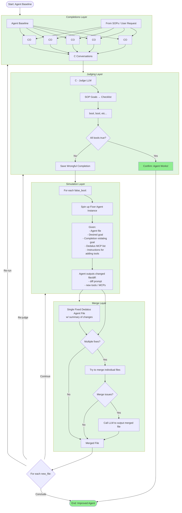

# Agent Orchestration System

A backend system that orchestrates AI agents to improve their prompts through iterative conversation generation, evaluation, and automated fixes.

## Architecture

## System Layers

### 1. Completions Layer
Generates multiple conversations between a base agent and various conversational agents with different prompts. Creates parallel conversation instances to test agent behavior across different scenarios.

**Input**: Base agent prompt, conversational agent prompts, initial message  
**Output**: List of conversations

### 2. Judging Layer
Evaluates conversations against SOP (Standard Operating Procedure) goals using a judge LLM. Each criterion is evaluated as a boolean, creating a checklist of requirements.

**Input**: Conversations, SOP goals/criteria, judge prompt  
**Output**: Boolean checklist for each criterion

### 3. Simulation Layer
For each failed criterion, spawns a parallel "fixer" agent that analyzes the failure and suggests modifications. Each fixer agent receives:
- The agent file
- The failed goal/criterion
- The violating conversation
- Available Dedalus MCP servers list
- Instructions for adding tools

**Input**: Failed criteria, conversations, agent file  
**Output**: Modified agent files/diffs with prompt changes, new tools, or new MCP servers

### 4. Merge Layer
Intelligently merges multiple modifications from fixer agents into a single coherent agent file. Uses automatic merging for simple cases and LLM-assisted merging for complex conflicts.

**Input**: Multiple modified agent files/diffs  
**Output**: Single merged agent file

### 5. Feedback Loop
The merged file triggers a new iteration:
- Re-run conversations layer
- Re-judge with judging layer
- Continue to simulation layer if needed
- Conclude when all criteria pass

## Tech Stack

- **Python** - Core backend logic
- **UV** - Package management
- **Dedalus Agents SDK** - Agent framework
- **Pydantic** - Type validation and structured outputs
- **Async/Await** - Parallel execution throughout

## Project Status

✅ **All core components complete and tested**
- Conversations Layer (async, parallel)
- Judging Layer (async, parallel, structured outputs)
- Simulation Layer (async, parallel, enhanced MCP support)
- Merge Layer (automatic + LLM-assisted)
- Orchestration Layer (full improvement loop)
- File Manager (read/write agent files)

See `AGENTS.md` for detailed implementation documentation.
